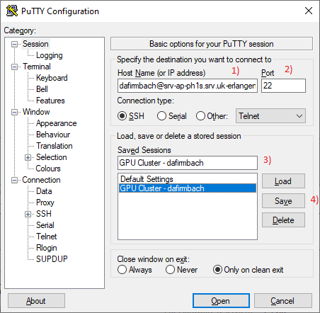
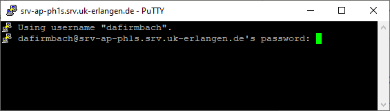
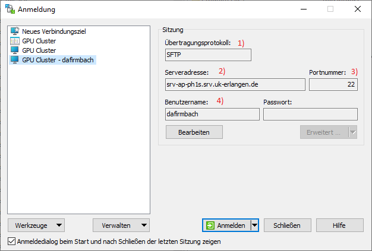
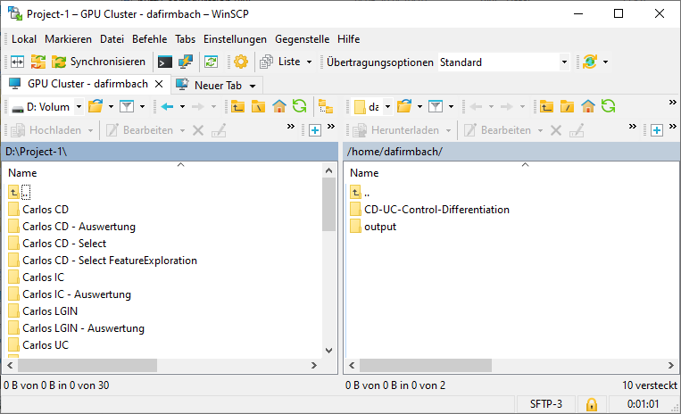

# Wiki for GPU Cluster

## General Information

This wiki shall provide you with the basic necessacary information to work with the GPU cluster. The following sections will provide steps for the initial setup. You find information to run jobs on the cluster [here](run_slurm_job.md), and for specific pipelines look [here (tbd)](). 

## Getting Access

Before you can start with the software, you need a username and password. To get this please get in touch with Christian Matek.

## Setup

### Putty

Install putty or download an executable to use directly ([Link](https://www.chiark.greenend.org.uk/~sgtatham/putty/latest.html)). 

You need the following configuration to access the cluster (see Figure 1 for reference):
- 1) Host Name of cluster: {{username}}@srv-ap-ph1s.srv.uk-erlangen.de
- 2) Port: 22

The username in the host name is a combination of you first and last name. It starts with the first two letters of your first name followed by your complete last name.



**Figure 1:** Window for configuration of putty. 

You can also save this configuration, so you can load it later for easier use. For this you have to (see Figure 1 for reference):
- Give the configuration a name in 3)
- Save the configuration in 4)

If you click on “Open” you start the connection and a terminal window opens. You are prompted to input your password (see Figure 2).



**Figure 2:** Terminal window for putty after starting connection. Prompting for the password.

Input your password and press enter. You are now logged into the cluster and can start your work.

### WinSCP

Install WinSCP or download an executable to use directly (Link).
You need to setup a configuration here as well. For this you need the following steps (see Figure 3 for reference):
- 1) Übertragungsprotokoll / TBD: SFTP
- 2) Serveradresse / TBD: srv-ap-ph1s.srv.uk-erlangen.de
- 3) Portnummer / Port: 22
- 4) Benutzername / TBD: {{username}} (see 2.1 for your username)



**Figure 3:** WinSCP configuration window.

After you press “Anmeldung” / “TBD” to log in, you are prompted to provide your password. Input the password and press enter.
You will see a window (see Figure 4) with the menu and options at the top and two large areas for your files. The left side displays files from your computer, whereas the right side displays files from the cluster. You can navigate through these files and folders the same way you do in a normal file explorer. 



**Figure 4:** WinSCP main window.

## Setup Environment

### Python Environment

#### Base Environment

After your initial login (or before you done the following step) you need to load the base environment. For this you need to run the following command:
```
source /opt/miniconda3/bin/activate
```
After you run the command, you should see a `(base)` at the most left of your new line.

#### Custom Environment

After you activated the bease environment, you can create your own custom environment, specifically adjusted to your needs.
To create this environment, use the command:
```
conda create -n venv_name
```
Where you can change `venv_name` to the desired name of your environment. Then you need to activate this environment. For this use the following command: 
```
conda activate venv_name
```
Again, change the `venv_name` accordingly. Now that you activated your own environment, you can start installing packages you require using `conda install` and so forth.

You can deactivate your environment and use other environments as you need. 

